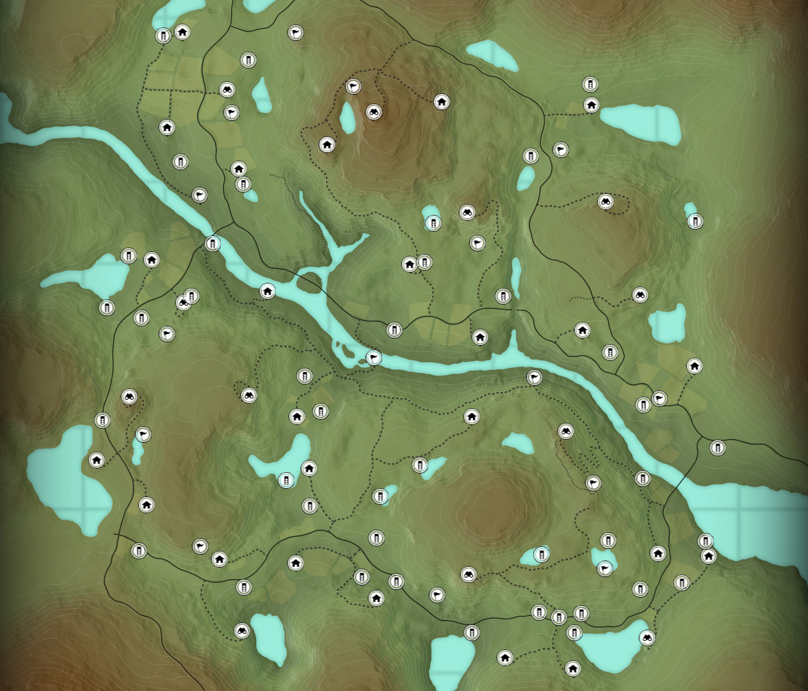

# Cuatro Colinas Game Reserve

# 简介

在四丘猎场（Cuatro Colinas， 翻译成“四峦山庄”更好听？）中，这四座标志性的山峰/岩峦分别位于地图的不同方位，它们不仅构成了地图的制高点，也正好对应了四种西班牙羱羊（Ibex）的栖息领地：

1. **北方峰峦：佩尼亚·德尔·阿吉拉（Peña del Águila）**
* **含义：** “鹰岩”（Eagle's Rock）
* **特点与猎物：** 位于地图北部/西北部的崎岖高山区域，也是最为雄壮的雪岭岩壁之一。这里主要栖息着角形呈优美竖向竖立微向外弯的 **格雷多斯羱羊（Gredos Ibex）**。

2. **东北峰峦：佩尼亚·布兰卡（Peña Blanca）**
* **含义：** “白岩”（White Rock）
* **特点与猎物：** 位于地图东北侧高地，山石多呈灰白风化质感。这里是体型与角型最为粗壮张扬的 **贝塞特羱羊（Beceite Ibex）** 的主要活动区域。

3. **南方峰峦：佩尼亚·德尔·苏尔（Peña del Sur）**
* **含义：** “南岩”（South Rock）
* **特点与猎物：** 坐落在地图南部干燥陡峭的岩崖带。这里盘踞着四种羱羊中体型最小、角形呈向后微卷琴弓状的 **隆达羱羊（Ronda Ibex）**。

4. **东南峰峦：塞罗·德尔·索尔（Cerro del Sol）**
* **含义：** “太阳丘 / 阳光峰”（Hill of the Sun）
* **特点与猎物：** 位于地图东南部边缘的高地上，光照充足且视野开阔。这里是长角平展向后螺旋弯曲的 **东南西班牙羱羊（Southeastern Ibex）** 的传统领地。

这四座高地环绕着地图中央的农业谷地（花田与橄榄林），形成了外围崇山险峰、内部庄园梯田的独特地貌。想要在陈列室摆出“西班牙羱羊大满贯”，就必须踏遍这四座峰峦。

# 任务
[Missions | TheHunter: Call of the Wild Wiki | Fandom](https://thehuntercotw.fandom.com/wiki/Missions)

保护区有15/15个主要任务和0/0个支线任务。

## 剧情任务

## 支线任务

# 地图
[Maps | TheHunter: Call of the Wild Wiki | Fandom](https://thehuntercotw.fandom.com/wiki/Category:Maps)

## 总图
[Map:Cuatro Colinas Game Reserve | TheHunter: Call of the Wild Wiki | Fandom](https://thehuntercotw.fandom.com/wiki/Map:Cuatro_Colinas_Game_Reserve?)

点击查看图片（Cuatro Colinas Game Reserve）

