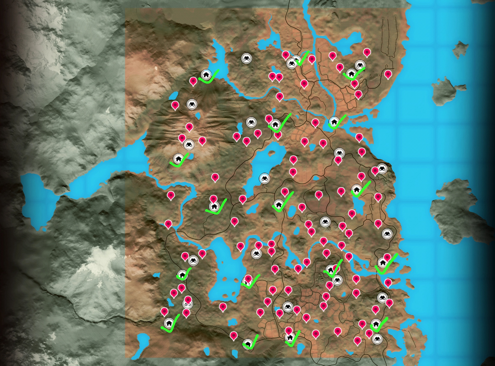
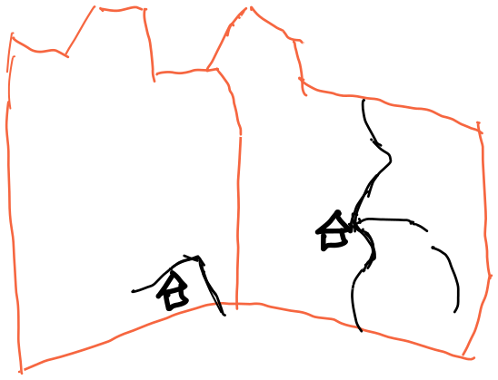

# 赫希费尔登狩猎保护区

# 任务
[Missions | TheHunter: Call of the Wild Wiki | Fandom](https://thehuntercotw.fandom.com/wiki/Missions)

保护区有28个主要任务和70个支线任务。

## 剧情任务

## 支线任务

# 总图

点击查看图片（赫希费尔登狩猎保护区）

主要包括以A，B，C为核心的几个区域。

## 细节图1（区域A及周边）

点击查看图片（赫希费尔登狩猎保护区）

